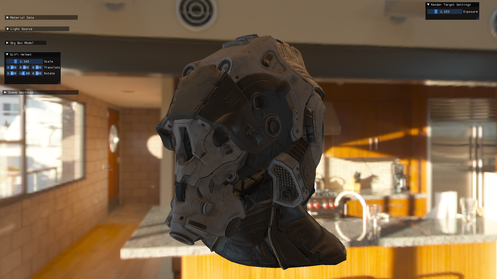
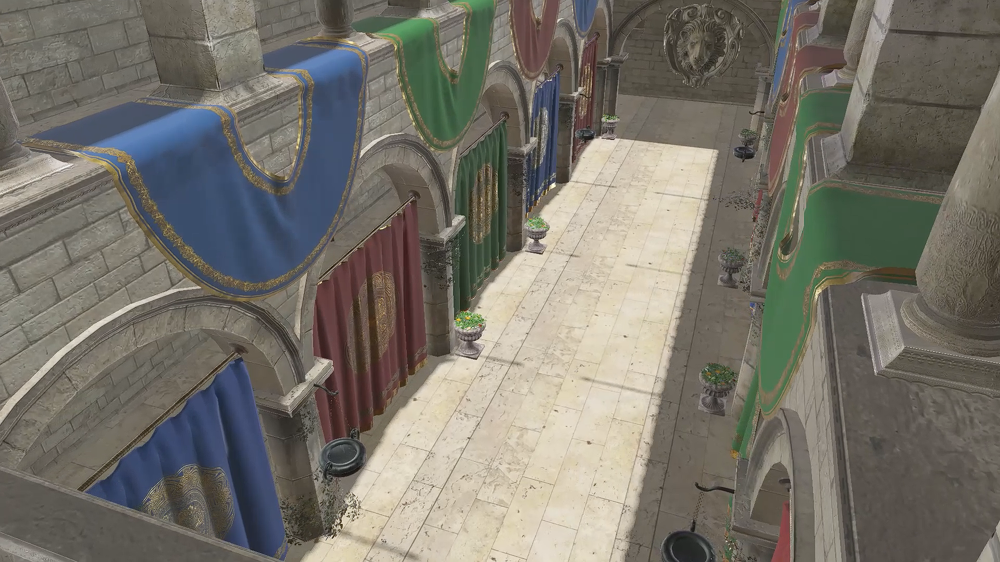
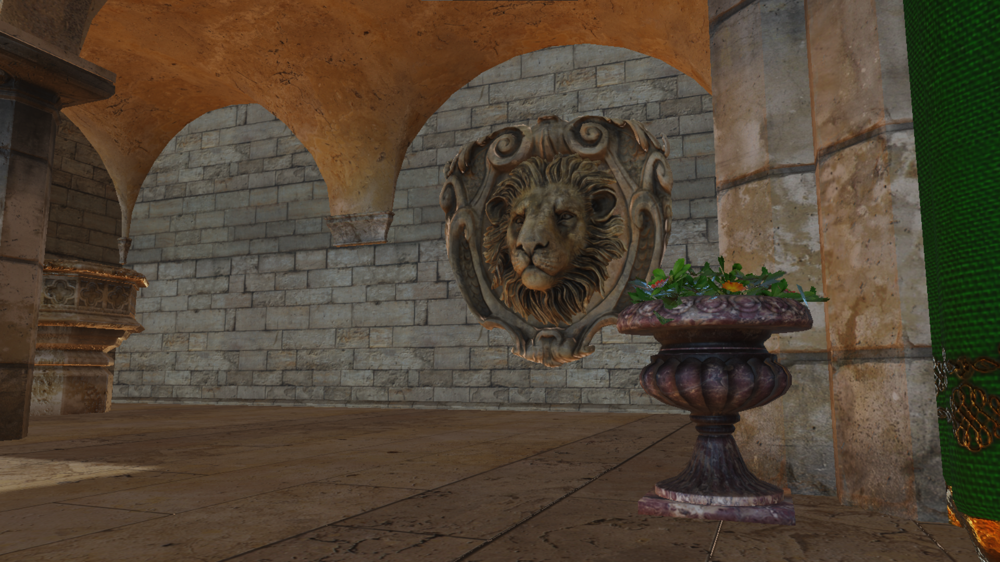
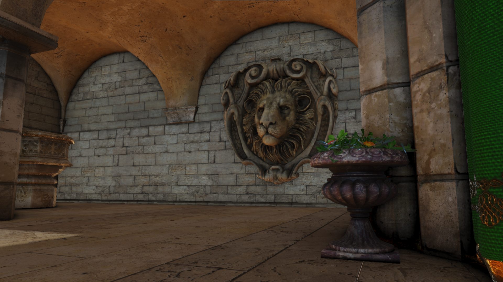
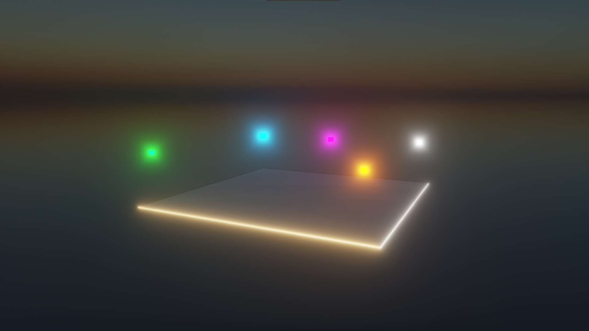
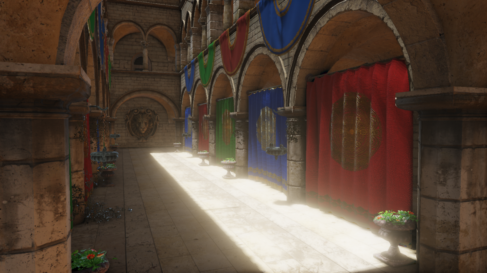
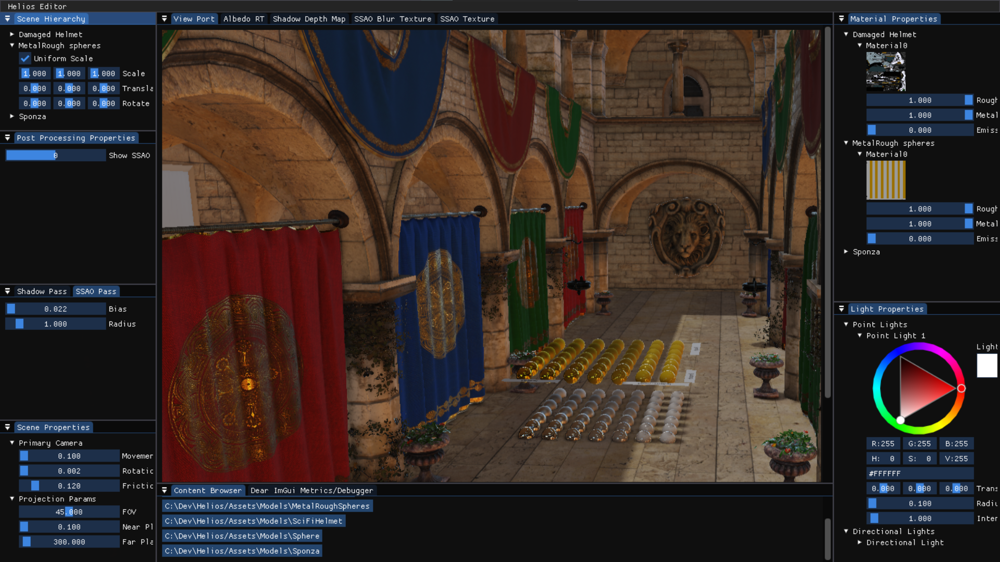

# Helios

An experimental C++20 & DX12 renderer made for learning and trying out various graphics / rendering techniques.

# Features
* Bindless Rendering (Using SM 6.6's Resource / Sampler descriptor Heap).
* Normal Mapping.
* Physically based rendering (PBR) [Lambertian Diffuse and Cook Torrence Specular BRDF].
* Diffuse and Specular IBL.
* Bloom (Based on the Call of Duty Next Generation Post Processing presentation).
* Screen Space Ambient Occlusion (SSAO).
* Blinn-Phong Shading.
* Deferred Shading.
* HDR and Tone Mapping.
* Shadow Mapping.
* Instanced rendering.
* Compute Shader mip map generation.
* Multi-threaded asset loading.
* Editor (ImGui Integration) with Logging and Content Browser with drag-drop functionality for GLTF models.
* D3D12MA integration.
* Shader Compilation using DirectX Shader Compiler (DXC).

# Gallery
> PBR and IBL



> Shadow Mapping (With PCF)


> SSAO (Screen Space Ambient Occlusion)
* Blurred SSAO texture


* SSAO Disabled (Top) with SSAO Enabled (Bottom)
 


> Bloom (Inspired from the Call of Duty Presentation on Next Generation Post Processing)



> Editor (using ImGui)


> Deferred Shading


# Showcase Video
[Link : Click here, or on the Image below!](https://youtu.be/hKeVVCpzVhQ) \
[](https://youtu.be/hKeVVCpzVhQ)

# Performance Metrics:
> Current performance metrics after optimizations:


> Pre-optimization performance metrics:


# Optimization efforts:
> Optimized for Turing Architecture NVIDIA GTX1650.

* Multi-threaded command list recording.
* Batching of resource barriers (as much as possible).
* Rewrite shaders to reduce number of registers used (for the SSAO compute shader).
* Switch several full screen passes to compute shaders (to be noted that Tiled rendering using full screen pixel shader does surpass compute shader performance, but if the optimal work group size is found, compute shader performance will be higher than pixel shader).
* Reordered render loop to prevent unnecessary Compute to Graphics pipeline switches (which cause wait for idle's internally).

# Third Party Libraries
* [Dear ImGUI](https://github.com/ocornut/imgui)
* [D3D12 Memory Allocator](https://github.com/GPUOpen-LibrariesAndSDKs/D3D12MemoryAllocator)
* [STB Image](https://github.com/nothings/stb)
* [Tiny GLTF](https://github.com/syoyo/tinygltf)

# Building
+ This project uses CMake as a build system, and all third party libs are setup using CMake's FetchContent().
+ After cloning the project, build the project using CMake :
``` 
cmake -S . -B Build
cmake --build Build --config Release
```

Alternatively open the folder in Visual Studio's open folder mode.
+ Run the `Setup.bat` file, which will install the DirectXAgility SDK and the DirectXShader Compiler. You will be asked to enter the build path, which was the same path you gave in cmake -S . -B 'BuildPath'. If you followed the commands above, BuildPath = Build.

# Controls
+ WASD -> Move camera.
+ Arrow keys -> Modify camera orientation.
+ Space -> Hold to disable editor UI.
+ Escape -> Exit editor.
+ Drag GLTF / GLB models from scene hierarchy to the main viewport (you might have to drag and drop in a region around the actual model path text).

# Reference Projects :
[Wicked Engine](https://github.com/turanszkij/WickedEngine) By Turánszki János. \
[Vanguard Engine](https://github.com/adepke/VanguardEngine/tree/master) By Andrew Depke. \
[Adria-DX12](https://github.com/mateeeeeee/Adria-DX12) By Mate Buljan. \
[DirectX Graphics Samples](https://github.com/Microsoft/DirectX-Graphics-Samples) from Microsoft.